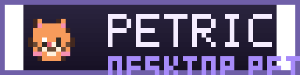
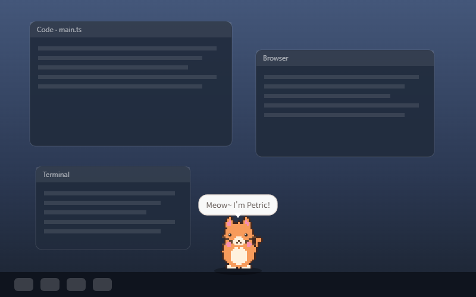
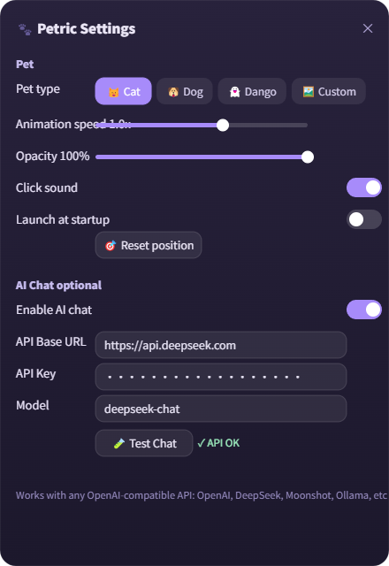

# 🐾 Petric · Cross-Platform Desktop Pet

> **English** | [中文](./README.md)




> A transparent, always-on-top desktop pet built with **Electron + TypeScript + HTML5 Canvas** (MVP).
> Supports Windows / macOS / Linux — pixel-art sprite animation, drag-and-walk, sleeping, click interactions, and OpenAI-compatible AI chat.




---

## ✨ Features

| Feature | Description |
| :--- | :--- |
| 🪟 Transparent always-on-top window | 300×300, frameless, always on top, hidden from taskbar, draggable |
| 🌐 Chinese/English switch | One-click UI language toggle in Settings (中文 / English); speech lines and bubbles follow |
| 🐱 Animated pixel pets | Gray cat / fox / rabbit / Bulu / robot, with real per-frame limb, tail and ear animation across four states |
| 🧊 3D model skins | Custom appearance supports GLB 3D models (WebGL rendering + raycast hit testing + procedural animation) |
| ✂️ Local AI cutout | Detects a person, pet, or main object and creates a transparent PNG locally (no upload, toggleable, adjustable strength) |
| 🐾 Photo pet | Upload your own pet photo → AI cutout → it becomes the desktop pet, with whole-image actions (dance / stretch / tilt…) |
| 👀 Eye tracking | The robot has procedural eye tracking; mark the two eyes on a photo pet to enable tracking, blinking and sleep closure |
| 🎞️ Four animation states | `idle` (breathing + blinking + tail wag) · `walking` (alternating limb steps) · `sleeping` · `click` (jump) |
| 💬 Click dialogue | Single-click plays a jump animation + random speech bubble (customizable) |
| 🤖 AI chat | Double-click opens a ChatGPT-style chat window with a conversation list (new chat / archive / rename / delete); works with any OpenAI-compatible API (OpenAI / DeepSeek / …); history stays on your machine |
| ⚙️ Settings panel | Skin / animation speed / opacity / auto-launch / sound / AI config / reset position |
| 🎵 Click sound | Short synthesized "meow" via Web Audio (toggleable) |
| ❤️ Affinity | Clicking / dragging / chatting raise your bond through 5 levels (Stranger → Best Friend); hearts shown on a corner badge |
| ⏰ Focus Mode | On by default: reminds you to "Stand up and stretch, boss!" every 40 minutes (configurable 20–90), with a chime and a jump; text follows the UI language |
| ☀️🌙 Theme switch | Light (orange-white gradient) / Dark (original purple) — the pet bubble, chat window and settings panel switch together |
| 🎩 Accessories | Procedural pixel hat / scarf / glasses for the robot skin |
| 🕺 Idle actions | The pet randomly yawns, stretches, scratches and dances while idle — it feels alive |
| 🚶 Auto wander | The pet walks / runs / jumps around your desktop on its own (not just when dragged); stays awake instead of sleeping while on (toggleable) |
| 📊 Interaction stats | Days together, click / chat counts and an affinity growth curve (chart in Settings) |
| 💬 Proactive chat | After 10 idle minutes the pet says hi on its own (toggleable) |
| ☁️ Weather | Clicking the pet sometimes reports today's weather (free APIs, fetched by the main process, toggleable) |
| ⏰ Hourly chime | The pet jumps and announces each hour (toggleable) |
| 📍 Position memory | Remembers its position and returns there on restart |

**Quick interactions**

| Action | Effect |
| :--- | :--- |
| Left-drag | The pet follows the cursor and plays its walking animation (affinity +1) |
| Single click | Jump animation + random line + sound (affinity +1; level-ups are announced) |
| Double click | Opens the ChatGPT-style AI chat window (or the settings panel if AI is disabled; each chat reply grants affinity +2) |
| Right-click / tray icon | Settings / AI chat / reset position / quit |
| `Ctrl + Shift + P` | Open the settings panel |
| `Esc` | In the chat window: close it; on the pet window: quit the app |
| No mouse/keyboard for 30s | The pet falls asleep (floating Zzz); any input wakes it |

---

## 🚀 Quick Start

### Requirements

- Node.js ≥ 18 (20+ recommended for development)
- npm (bundled with Node)

### Install & Run

```bash
# 1. Install dependencies (first run downloads the Electron binary, ~100MB)
npm install

# 2. Build & launch (auto-generates sprites, compiles TS, starts the app)
npm run dev
```

A pixel kitten will appear at the center of your screen. Try dragging it, clicking it, double-clicking it, and pressing `Ctrl + Shift + P` to open settings.

> 💡 **Windows note (PowerShell execution policy)**
> If you see `npm.ps1 cannot be loaded because running scripts is disabled`, either:
>
> ```powershell
> # Option A: use the .cmd variant (no settings changes needed)
> npm.cmd run dev
>
> # Option B: allow script execution for the current user (recommended, one-time)
> Set-ExecutionPolicy -Scope CurrentUser RemoteSigned
> npm run dev
> ```
>
> This project ships a launch wrapper (`scripts/run-electron.mjs`) that clears any
> injected `ELECTRON_RUN_AS_NODE` variable (which would make Electron run as plain
> Node) and runs Electron with inherited stdio so logs and exit codes pass through.

### Useful Scripts

| Command | Description |
| :--- | :--- |
| `npm run dev` | Build and launch the dev version |
| `npm run build` | Generate sprites + compile TypeScript + copy static assets to `dist/` |
| `npm run sprites` | Regenerate the pixel sprites and icons only (`scripts/generate-sprites.mjs`) |
| `npm run smoke` | Build and run the smoke test (checks pet window + settings panel + chat window with deep diagnostics; exit code 0 = pass) |
| `npm run dist` | Package the current platform (Windows: NSIS / macOS: DMG / Linux: AppImage + deb) |
| `npm run dist:win` / `dist:mac` / `dist:linux` | Package a specific platform |

---

## 📦 Packaging & Distribution

Uses [electron-builder](https://www.electron.build/); see `electron-builder.yml`:

- **Windows**: `.exe` (NSIS installer, custom install directory, desktop shortcut)
- **macOS**: `.dmg` + `.zip` (unsigned — on first launch use right-click → Open, or configure your own signing)
- **Linux**: `.AppImage` + `.deb`

```bash
npm run dist          # package the current platform
npm run dist:win      # package the Windows build on Windows
```

Artifacts are written to the `release/` directory.

> ⚠️ Platform notes:
> - Cross-platform packaging (e.g., building a macOS package on Windows) requires the target
>   platform environment; use per-platform runners in CI (GitHub Actions) for release builds.
> - A production macOS release needs an Apple Developer certificate and notarization; unsigned
>   builds are fine for personal use.
> - Windows SmartScreen may warn "Unknown publisher" on first launch — click
>   "More info → Run anyway" (configure code-signing for official distribution).

---

## ⚙️ Settings Panel

| Setting | Description |
| :--- | :--- |
| Language | 中文 / English one-click toggle (persisted; tray, context menu and speech lines switch too) |
| Theme | Light (orange-white gradient) / Dark (original purple) — the pet window, chat window and settings panel switch together |
| Pet type | Gray cat 🐱 / Fox 🦊 / Rabbit 🐰 / Bulu 🐈 / Robot 🤖 — switches instantly |
| Accessory | None / Hat 🎩 / Scarf 🧣 / Glasses 👓 — procedural pixel art for the robot skin |
| Auto cutout | Local U-2-Netp subject segmentation for complex photo backgrounds; strength slider 8–60; applies to "Single image" and "2.5D standee" modes |
| Eye tracking | In "Single image" mode, mark the two eyes on your photo — pupils follow the cursor and blink |
| Affinity | Current affinity value and level (clicking / dragging / chatting raise it; persisted) |
| Interaction stats | Days together, first day, click / chat counts and the affinity growth curve |
| Animation speed | 0.5x ~ 2x slider, applies to all animation frame rates |
| Opacity | 0.5 ~ 1.0 slider (whole-window opacity) |
| Click sound | Web Audio synthesized sound, toggleable |
| Auto-launch | Based on the native `app.setLoginItemSettings` API |
| Auto wander | The pet walks / runs / jumps around the desktop by itself; while on it stays awake (no 30 s auto-sleep), off restores the original sleep behavior |
| Reset position | Back to the center of the primary display |
| Focus Mode | Break-reminder toggle + interval (20 / 30 / 40 / 60 / 90 minutes) |
| Life Assistant | Independent toggles: proactive chat / weather / hourly chime |
| AI chat | Enable toggle + Base URL + API Key + model name + test button |

### 🤖 Configuring AI Chat

> ⚠️ **BYOK (Bring Your Own Key)**: this repository ships **no API key of its own** — the
> default config only holds placeholders (the sample Base URL is `https://api.openai.com/v1`)
> and AI chat is off by default. Every user — you, or anyone who clones / downloads this repo —
> must **sign up with an AI provider themselves** and enter **their own** Base URL + API Key +
> model name. Requests are sent only to the endpoint you configure and nowhere else.

Double-click the pet (or tray / right-click menu → "💬 AI Chat") to open the chat window; first
finish the setup under Settings → "AI Chat". Any **OpenAI-compatible** `/chat/completions`
endpoint works:

| Provider | API Base URL | Example model |
| :--- | :--- | :--- |
| OpenAI | `https://api.openai.com/v1` | `gpt-4o-mini` |
| DeepSeek | `https://api.deepseek.com` (`/v1` is appended automatically) | `deepseek-chat` |
| Moonshot | `https://api.moonshot.cn/v1` | `moonshot-v1-8k` |
| Ollama (local) | `http://localhost:11434/v1` | `qwen2.5` |

Fill in the values, hit "🧪 Test Chat" to verify, then double-click the pet to chat.

The chat window supports multiple conversations: from the left-hand list you can **start a new
chat, archive (📁 Archived section), rename or delete** conversations; both the pet window and
the chat window share the same history in real time.

> 🔒 **Privacy & data location**: the API key and chat history stay on your machine
> - AI config: `userData/config.json`
> - Chat history: `userData/chat-store.json` (persisted by the main process, shared by the pet window and the chat window)
> Nothing is uploaded anywhere except to the AI provider you configured. AI is off by default and
> costs nothing until you add a key.

---

## 🎨 Customization Guide

### 0. 🖼️ Use Your Own Image or 3D Model as the Pet

> Besides the built-in cat/fox/rabbit, you can use any image or 3D model as your pet — dragging,
> clicking, sleeping, AI chat, and settings all keep working (3D mode uses raycast hit testing).

**Way 1: In-app (recommended, works in packaged builds too)**
Settings → Pet type → "🖼️ Custom" → "Choose File…" → pick an image or a `.glb` model, applied instantly.
The file is stored in `userData/petric-custom/`; use "Clear Custom Appearance" to restore.

**Way 2: Command line (handy in dev)**
```bash
# Single image (default)
node scripts/set-custom.mjs your-image.png

# Sprite sheet (4 rows × 4 columns frame animation)
node scripts/set-custom.mjs your-sheet.png --mode sheet

# 3D model (.glb, auto-detected, no --mode needed)
node scripts/set-custom.mjs your-model.glb

# Restore default
node scripts/set-custom.mjs --clear
```

**Four appearance types**

| Type | Description |
| :--- | :--- |
| Single image | Any PNG / JPG / WebP / GIF (≤15MB). Shown as-is; the app adds procedural breathing / walking bounce / sleep dimming / click jump. Animated GIFs play their own animation. |
| Sprite sheet | 4 rows × 4 columns, equal-sized frames (row order: idle / walking / sleeping / click); frame size is auto-detected and all four animation states are preserved. |
| 3D model | GLB format (≤60MB). WebGL rendering, auto-fitted size & lighting, procedural idle / walking / sleeping / click animation, raycast hit testing. Export from Blender (glTF Binary) or VRoid Studio. |
| 2.5D standee | A single image placed in the 3D scene: it turns toward the cursor and leans while dragging, with real perspective — looks 3D while staying a flat plane; hit testing uses raycast + texture-alpha refinement. |

> ⚠️ Note: with a custom image or model, "eye tracking" is disabled automatically (the built-in
> robot eyes are drawn by the renderer and can't be positioned on arbitrary assets); all other
> interactions remain. Images with transparent backgrounds look best. 3D mode requires WebGL
> support (available on virtually all machines).

### 1. Replacing / Adding Sprite Sheets

The gray cat, fox, rabbit and Bulu sheets live in `src/assets/animated-pets/`. Each is a
256×256, 4×4 sheet with 64×64 frames. The robot lives in `src/assets/sprites/` and is
generated by `scripts/generate-sprites.mjs`.

**Option A: swap in your own sheet (recommended)**
Replace the file with the same name — no code changes needed:

```
src/assets/animated-pets/cat.png     ← 256×256, 4 rows × 4 columns (idle/walking/sleeping/click, 64×64 frames)
```

**Option B: extend the generator for a new pet**
In `scripts/generate-sprites.mjs`:
1. Add a color palette to `PALETTES`;
2. Add a `kind` branch in `drawPet()` (ears / tail / snout shapes);
3. Register the skin in the renderer: `loadSheets()` in `src/renderer/app.ts` and the `#skin-seg` buttons in `src/renderer/settings.ts`;
4. Run `npm run sprites`.

The illustrated animal sheets contain their complete faces. Robot eyes/blinks and the Zzz
particles are overlaid by the renderer.

### 2. Changing the Speech Lines

Edit the `lines` arrays in `src/shared/i18n.ts` (`zhDict` / `enDict` — click lines follow the UI language):

```ts
lines: ['喵～', '别摸我！', '饿了…', '今天也要加油鸭！'],   // zhDict
lines: ['Meow~', "Don't touch me!", 'I\'m hungry…'],       // enDict
```

### 3. Tweaking Animation / Sleep Parameters

- Per-state frame rates: `SHEET.states` in `src/renderer/app.ts` (mirrors `STATE_FPS` in the generator)
- Sleep threshold: `SLEEP_MS` (default 30000ms)
- Blink rhythm: the random range of `blinkTimer`
- Bubble styling: `#bubble` in `src/renderer/styles.css`

---

## 🗂️ Project Structure

```
petric/
├── src/
│   ├── main/
│   │   ├── main.ts            # Main process: window/tray/IPC/AI requests/chat orchestration/auto-launch
│   │   ├── chat-store.ts      # Conversation store: local persistence (userData/chat-store.json)
│   │   └── preload.ts         # contextBridge exposes window.api
│   ├── renderer/
│   │   ├── index.html         # Pet window page
│   │   ├── styles.css         # Pet window styles (transparent bg / bubbles / affinity badge)
│   │   ├── i18n.ts            # Renderer i18n (window.PetricI18n, dictionary from the main process)
│   │   ├── app.ts             # Canvas drawing, animation state machine, drag, interactions & chat rewards
│   │   ├── pet3d.ts           # 3D model rendering (three.js UMD + GLTFLoader, raycast hit testing)
│   │   ├── chat.html / chat.css / chat.ts   # ChatGPT-style chat window (conversation list / messages / archive)
│   │   ├── settings.html      # Settings panel page
│   │   ├── settings.css       # Glassmorphism settings panel styles
│   │   └── settings.ts        # Settings panel logic
│   ├── shared/
│   │   ├── types.ts           # Global shared types (compile-time only, no runtime)
│   │   ├── config.ts          # Config read/write (userData/config.json)
│   │   └── i18n.ts            # Chinese/English UI string dictionaries (single source)
│   └── assets/
│       ├── sprite-sources/    # Original cat / fox / rabbit reference art
│       ├── animated-pets/     # 64px four-state sheets for gray cat / fox / rabbit / Bulu
│       ├── sprites/           # Procedural robot and compatibility sheets
│       ├── models/            # Test 3D model test-pet.glb
│       ├── vendor/            # Vendored three.js UMD build (MIT)
│       ├── icon.png / icon.ico / icon.icns / tray.png
├── scripts/
│   ├── generate-sprites.mjs   # Pixel sprite & icon generator (zero-dependency PNG encoder)
│   ├── prepare-animated-pet.mjs # Cleans, slices and normalizes 4×4 animation art
│   ├── copy-vendor.mjs        # Copies the three.js UMD build from node_modules into vendor/
│   ├── make-test-model.mjs    # Generates the test 3D model (GLB)
│   ├── copy-assets.mjs        # Copies html/css/assets into dist/ on build
│   ├── run-electron.mjs       # Electron launch wrapper (clears ELECTRON_RUN_AS_NODE)
│   └── set-custom.mjs         # CLI to set a custom appearance (image / sprite sheet / 3D model)
├── package.json
├── tsconfig.json
├── electron-builder.yml
├── README.md
└── README-EN.md
```

**Technical highlights**

- Main / preload / renderer are all TypeScript, compiled to CommonJS by `tsc` (renderer files are
  module-free single scripts to avoid ES Module CORS restrictions under `file://`).
- Renderer ↔ main communicate only through `window.api` (IPC), with
  `contextIsolation: true` + `sandbox: true`.
- AI network requests are made in the **main process** to avoid browser CORS restrictions.
- Chat data is managed centrally in the **main process** (`chat-store.ts`, persisted to
  `userData/chat-store.json`); the pet window and the chat window stay in sync through
  `chats-changed` broadcasts.
- Dragging uses screen-coordinate absolute positioning (`screenX/Y` + window position) — no cumulative drift.
- Transparent window + `backgroundThrottling: false` keeps `requestAnimationFrame` running reliably.
- The 3D mode uses a vendored **three.js UMD (MIT)** build — no bundler needed; hit testing uses
  `THREE.Raycaster` instead of the 2D pixel hitmap.

---

## 🧪 Known Limitations (MVP)

- **Per-pixel click-through**: only the pet's **visible pixels** trigger interactions; clicks on
  transparent areas pass through to the desktop (Windows switches dynamically via
  `setIgnoreMouseEvents(forward)`; 3D mode uses raycast). macOS / Linux don't support `forward`
  (enabling pass-through means no events are received and the pet becomes unreachable), so they
  fall back to renderer-side hit testing — transparent areas won't trigger the pet, but clicks
  there still don't pass through.
- **3D mode (current stage)**: GLB only; VRM humanoid models (skeletal expressions etc.) are a
  next-stage feature. 3D requires WebGL; after frequent 2D/3D switching, a window reload may be
  needed to re-initialize the WebGL context.
- **macOS transparent window**: the Dock icon is hidden; add vibrancy in `main.ts` if you want a frosted-glass effect.
- **Unsigned packages**: Windows SmartScreen / macOS Gatekeeper will warn about the unknown developer.
- **Built-in appearances**: gray cat / fox / rabbit / Bulu / robot; add more via the Customization Guide.

---

## 📸 Screenshots & Demo

```bash
# Auto-generate the README header images (docs/screenshots/)
npm run build && electron . --screenshot
```

- `docs/screenshots/pet-cat.png`: the pet on a (simulated) desktop — composited from the real sprite sheet
- `docs/screenshots/settings-panel.png`: the settings panel (canvas recreation)
- `docs/screenshots/demo.gif`: drag / click / animation switching / AI chat demo — record it on your own
  machine with [ScreenToGif](https://www.screentogif.com/) and drop it in

> Want real desktop screenshots instead of the generated ones? Just overwrite the files in `docs/screenshots/`.

---

## 🤝 Contributing

All contributions are welcome:

- 🎨 New sprite skins (follow the 32×32-frame / 4-row sheet spec, or extend the generator)
- ✨ New animations / interactions (Pomodoro mode, weather awareness, multi-monitor pets, …)
- 🐛 Bug fixes and polish
- 📖 Docs and demos

Flow: Fork → new branch → open a PR. Make sure `npm run build` passes and include a short description.

See [CONTRIBUTING.md](./.github/CONTRIBUTING.md) and [CODE_OF_CONDUCT.md](./.github/CODE_OF_CONDUCT.md).

---

## 📄 License

[MIT](./LICENSE) © Petric Contributors

- The gray cat / fox / rabbit / Bulu animations were generated from project-provided references and ship with this repository; the robot is procedurally generated by the project.
- 3D rendering uses [three.js](https://threejs.org/) (MIT, vendored into `src/assets/vendor/`).
- If you replace them with third-party art or models, verify their license yourself
  (CC0 / MIT / OGA-BY 3.0 recommended, and credit the source in the README).
