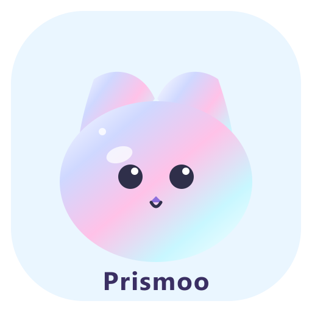

# 🐱 Prismoo · 跨平台桌面宠物

> **中文** | [English](./README-EN.md)




> Tauri 2 + Rust + TypeScript + HTML5 Canvas 构建的透明置顶桌面宠物（MVP）。
> 支持 Windows / macOS / Linux，像素风精灵动画、拖拽行走、睡眠、点击互动与 OpenAI 兼容 AI 对话。


## 📥 下载

普通用户请前往 [GitHub Releases](https://github.com/Aceeee2077/Desk-Petrick/releases/latest)
下载最新的 `Prismoo_x.y.z_x64-setup.exe` 安装包（约 2 MB）。

也可以自行构建：见下方「打包与分发」，一条 `npx tauri build` 即可产出安装包。


---

## ✨ 功能一览

| 功能 | 说明 |
| :--- | :--- |
| 🪟 透明置顶窗口 | 300×300、无边框、始终置顶、不占任务栏、可拖拽移动 |
| 🌐 中英文切换 | 设置面板一键切换界面语言（中文 / English），台词与气泡随语言变化 |
| 🐱 像素桌宠动画 | 内置灰猫 / 狐狸 / 兔子 / 布噜 / 机器人；四态逐帧动画包含真实四肢、尾巴与耳朵动作 |
| 🐾 照片宠物 | 上传自家宠物照片 → 自动去背 → 直接成为桌宠；支持整图动作（跳舞 / 伸懒腰 / 歪头等） |
| 👀 眼睛跟随 | 机器人支持程序眼睛跟随；照片宠物标记两只眼睛后同样生效，打瞌睡会闭眼 |
| 🎞️ 四态动画 | `idle` 待机（呼吸+眨眼+尾巴摆动）· `walking` 行走（四肢交替迈步）· `sleeping` 入睡 · `click` 点击跳跃 |
| 💬 点击台词 | 单击播放跳跃动画 + 随机气泡台词（可自定义） |
| 🤖 AI 对话 | 双击打开 ChatGPT 风格的对话窗口：左侧会话列表 +「新的对话」/ 归档 / 重命名 / 删除；支持 OpenAI / DeepSeek 等任意兼容接口，历史保存在本机 |
| ⚙️ 设置面板 | 皮肤 / 动画速度 / 透明度 / 开机自启 / 音效 / AI 配置 / 重置位置 |
| 🎵 点击音效 | Web Audio 实时合成的短促“喵”音（可关闭） |
| ❤️ 好感度 | 点击 / 拖拽 / 聊天都会增进好感，5 个等级（陌生→挚友），角落爱心徽章实时展示 |
| ⏰ 专注模式 | 默认开启：每隔 40 分钟（可调 20~90 分钟）提醒“站起来活动活动啊老板！”，带提示音与跳跃动画，文案随语言切换 |
| ☀️🌙 主题切换 | 浅色（橙白渐变） / 深色（原紫调）一键切换，宠物气泡 / 对话窗口 / 设置面板同步换肤 |
| 🎩 装扮系统 | 机器人可戴程序化像素配饰：帽子 / 围巾 / 眼镜 |
| 🕺 随机小动作 | 发呆时自动打哈欠、伸懒腰、挠头、跳舞，让宠物"活"起来 |
| 🚶 自主走动 | 宠物会在桌面上自己走动 / 奔跑 / 跳跃，不再只是拖拽才动；开启后保持清醒不入睡（可开关） |
| 📊 互动统计 | 陪伴天数、点击 / 聊天次数、好感度成长曲线（设置面板图表展示） |
| 💬 主动搭话 | 空闲 10 分钟宠物会主动问好（可开关） |
| ☁️ 天气播报 | 点击宠物随机播报今日天气（免费 API，Rust 侧请求，可开关） |
| ⏰ 整点报时 | 每小时整点宠物跳一下并报时（可开关） |
| 📍 记忆位置 | 记住上次位置，重启后回到原处 |
| 🔄 自动更新 | ⏳ 尚未接入：Tauri 版还在迁移中，当前安装包不会自动升级 |

**操作速查**

| 操作 | 效果 |
| :--- | :--- |
| 左键拖拽 | 宠物跟随移动，播放行走动画（好感度 +1） |
| 单击 | 跳跃动画 + 随机台词 + 音效（好感度 +1，升级时播报新等级） |
| 双击 | 打开 ChatGPT 风格的 AI 对话窗口（未启用 AI 时打开设置；每次聊天回复好感度 +2） |
| 右键 / 托盘 | 设置 / AI 对话 / 重置位置 / 退出 |
| `Ctrl + Shift + P` | 打开设置面板 |
| `Esc` | 宠物窗口按 Esc 退出应用；对话窗口内按 Esc 关闭该窗口 |
| 鼠标/键盘无操作 30s | 自动入睡（Zzz 飘动），任何操作唤醒 |

---

## 🚀 快速开始

### 环境要求

- **Node.js ≥ 18**（开发环境建议 20+）与 npm
- **Rust 工具链**：用 [rustup](https://rustup.rs/) 安装 stable 通道
- **Windows**：Visual Studio Build Tools（勾选「使用 C++ 的桌面开发」）+ WebView2 运行时（Win11 自带，Win10 通常也已预装）
- **macOS**：Xcode Command Line Tools
- **Linux**：`webkit2gtk` / `libayatana-appindicator` 等，详见 [Tauri 前置条件](https://tauri.app/start/prerequisites/)

### 安装与运行

```bash
# 1. 安装依赖
npm install

# 2. 构建前端（生成精灵图 + TypeScript 编译 + 资源拷到 dist/）
npm run build

# 3. 编译并启动调试版
npm run tauri:build
./src-tauri/target/debug/prismoo.exe
```

启动后，一只像素小猫会出现在屏幕中央。试试拖拽、单击、双击，以及 `Ctrl + Shift + P` 打开设置。

> 💡 **调试版 vs 发布版**
> `npm run tauri:build` 产出调试版，会附带一个控制台窗口——`println!`、panic 和 `npm run tauri:check` 的自检报告都在那里输出。
> 想要没有控制台窗口的版本用 `npm run tauri:build:release`，产物在 `src-tauri/target/release/prismoo.exe`。

> 💡 **Windows 提示（PowerShell 执行策略）**
> 如果提示 `无法加载 npm.ps1，因为在此系统上禁止运行脚本`，任选其一：
>
> ```powershell
> # 方式 A：直接用 .cmd 版本（无需改任何设置）
> npm.cmd run dev
>
> # 方式 B：允许当前用户执行脚本（推荐，一次搞定）
> Set-ExecutionPolicy -Scope CurrentUser RemoteSigned
> npm run dev
> ```
>
> 💡 **crates.io 拉取慢或超时**
> 本项目在 `src-tauri/.cargo/config.toml` 放了一份本地镜像配置（rsproxy）。该文件已加入 `.gitignore`，
> 不影响 CI 和其他机器；删掉它即可恢复使用官方源。

### 常用脚本

| 命令 | 说明 |
| :--- | :--- |
| `npm run build` | 前端构建：精灵图 / 图标 / TypeScript 编译 / 资源拷贝 / 生成 `src-tauri/resources/i18n.json` |
| `npm run tauri:build` | 编译 Tauri 调试版（`src-tauri/target/debug/prismoo.exe`） |
| `npm run tauri:build:release` | 编译 Tauri 发布版（无控制台窗口） |
| `npm run tauri:check` | 编译并运行三阶段自检：宠物窗口渲染 / 设置读写 / 聊天会话增删改查，退出码 0=通过 |
| `npx tauri build` | 打包安装包（Windows 为 NSIS），输出到 `src-tauri/target/release/bundle/` |
| `npm run sprites` | 仅重新生成像素精灵图与图标（`scripts/generate-sprites.mjs`） |
| `npm run brand-icons` | 重新生成品牌图标（`icon.png` / `ico` / `icns` / `tray.png`） |

---

## 📦 打包与分发

使用 [Tauri 2](https://tauri.app/) 打包，配置见 `src-tauri/tauri.conf.json`：

- **Windows**：`.exe`（NSIS 安装包，支持自定义安装目录、桌面与开始菜单快捷方式）
- **macOS**：`.dmg` / `.app`
- **Linux**：`.AppImage` / `.deb`

```bash
npm run build       # 构建前端（npx tauri build 也会自动跑一次）
npx tauri build     # 打包当前平台
```

产物输出到 `src-tauri/target/release/bundle/`：

```
src-tauri/target/release/bundle/nsis/Prismoo_0.5.0_x64-setup.exe
```

体积参考：安装包约 **2.05 MB**，可执行文件约 **4.84 MB**（迁移前的 Electron 版分别是 140 MB / 188 MB）。

> ⚠️ 平台说明：
> - Tauri 使用系统自带的 WebView（Windows 为 WebView2），**不需要**把浏览器内核打进包里，这是体积大幅缩小的原因。
> - 跨平台打包需要在对应平台上进行，一般建议在 CI（GitHub Actions）里用各平台 runner 分别构建。
> - macOS 发布正式版需要 Apple Developer 证书签名与公证；个人使用可不签名。
> - Windows 首次运行 SmartScreen 可能提示“未知发布者”，点击“更多信息 → 仍要运行”即可（正式分发请配置代码签名证书）。
> - 如果目标机器可能缺少 WebView2，可在 `tauri.conf.json` 里把 `bundle.windows.webviewInstallMode` 改为离线内嵌安装模式。

### 🔄 自动更新

> ⏳ **迁移中**：Tauri 版尚未接入 `tauri-plugin-updater`，当前安装包**不会**自动升级。
> 在这之前，请手动到 [GitHub Releases](https://github.com/Aceeee2077/Desk-Petrick/releases/latest)
> 下载新版安装包覆盖安装。
>
> 迁移前的 Electron 版基于 `electron-updater`：打包时生成 `latest.yml` 元数据随安装包一起挂到
> GitHub Release，客户端启动约 8 秒后比对版本、后台下载，就绪后弹窗「🔄 立即重启更新」。
> Tauri 的对应机制是 `latest.json` + minisign 签名，会在后续版本接上（托盘与右键菜单里的
> 「检查更新」目前是禁用状态，功能接好后会自动恢复可用）。

---

## ⚙️ 设置面板

| 设置项 | 说明 |
| :--- | :--- |
| 界面语言 | 中文 / English 一键切换（持久化，托盘/右键菜单/气泡台词同步切换） |
| 主题 | 浅色（橙白渐变）/ 深色（紫调）一键切换，宠物窗口 / 对话窗口与设置面板同步生效 |
| 宠物类型 | 灰猫 🐱 / 狐狸 🦊 / 兔子 🐰 / 布噜 🐈 / 机器人 🤖，实时切换 |
| 配饰 | 无 / 帽子 🎩 / 围巾 🧣 / 眼镜 👓，程序化像素绘制，仅机器人显示 |
| 眼睛跟随 | 「单张图片」模式下标记照片里的两只眼睛，瞳孔跟随鼠标 + 眨眼 |
| 好感度 | 当前好感值与等级（点击 / 拖拽 / 聊天会增加，持久化保存） |
| 互动统计 | 陪伴天数、首次陪伴日期、点击 / 聊天次数、好感度成长曲线 |
| 动画速度 | 0.5x ~ 2x 滑块，作用于所有动画帧率 |
| 透明度 | 0.5 ~ 1.0 滑块（Tauri 版暂未生效，见「已知限制」） |
| 点击音效 | Web Audio 合成音，可关闭 |
| 开机自启 | 基于 `tauri-plugin-autostart`（Windows 注册表 Run 项 / macOS LaunchAgent / Linux .desktop） |
| 自主走动 | 宠物自己在桌面上走动 / 奔跑 / 跳跃；开启后不自动入睡，关闭恢复 30 秒入睡 |
| 重置位置 | 回到主屏幕中央 |
| 专注模式 | 站立提醒开关 + 提醒间隔（20 / 30 / 40 / 60 / 90 分钟） |
| 生活助手 | 主动搭话 / 天气播报 / 整点报时 三个独立开关 |
| AI 对话 | 启用开关 + Base URL + API Key + 模型名 + 测试按钮 |

### 🤖 配置 AI 对话

> ⚠️ **自带 Key（BYOK · Bring Your Own Key）**：本仓库**不内置任何 API Key**，默认配置
> 里只有占位值（Base URL 示例为 `https://api.openai.com/v1`），AI 对话默认关闭。
> 无论是你自己，还是 clone / 下载本仓库的其他人，都需要**自行注册 AI 服务商**并填写
> **自己的** Base URL + API Key + 模型名。程序只会把请求发给你填写的那个地址，绝不上传到他处。

双击宠物（或托盘 / 右键菜单「💬 AI 对话」）即可打开对话窗口；先到设置 →「AI 对话」完成配置。
任意 **OpenAI 兼容** 的 `/chat/completions` 接口均可使用：

| 服务商 | API Base URL | 模型示例 |
| :--- | :--- | :--- |
| OpenAI | `https://api.openai.com/v1` | `gpt-4o-mini` |
| DeepSeek | `https://api.deepseek.com`（自动补 `/v1`） | `deepseek-chat` |
| Moonshot | `https://api.moonshot.cn/v1` | `moonshot-v1-8k` |
| Ollama（本地） | `http://localhost:11434/v1` | `qwen2.5` |

填好后点「🧪 测试对话」验证，然后双击宠物开始聊天。

对话窗口支持多会话管理：左侧列表可 **新建对话 / 归档（📁 已归档区）/ 重命名 / 删除**；
同一份对话历史在宠物与对话窗口间实时共享。

> 🔒 **隐私与数据位置**：API Key 与对话历史只保存在本机
> - AI 配置：`<应用配置目录>/config.json`
> - 对话历史：`<应用配置目录>/chat-store.json`（由 Rust 统一持久化，宠物窗口与对话窗口共享）
> - Windows 上应用配置目录为 `%APPDATA%\com.petric.desktop-pet\`
>
> ⚠️ Tauri 版的配置目录与迁移前的 Electron 版（`%APPDATA%\Prismoo\`）不同，所以旧版的设置与对话历史
> 不会自动继承——一次性迁移尚未实现。
> 不会上传到除你配置的 AI 服务商以外的任何地方；AI 功能默认关闭、不填 Key 不产生任何费用。

---

## 🎨 自定义指南

### 0. 🖼️ 用你自己的图片当宠物

> 内置的猫/狐狸/兔子之外，你还可以用自己的图片当宠物——拖拽、点击、睡眠、
> AI 对话、设置等所有功能照常工作。

**方式一：应用内选择（推荐，打包后同样可用）**
设置面板 → 宠物类型选「🖼️ 自定义」→ 「选择文件…」→ 选图片，实时生效。
文件会复制到应用数据目录的 `custom/` 下，可随时「清除自定义外观」还原。

**方式二：命令行（开发环境便捷）**
```bash
# 单张图片（默认）
node scripts/set-custom.mjs 你的图片.png

# 精灵表（4 行 × 4 列帧动画）
node scripts/set-custom.mjs 你的精灵表.png --mode sheet

# 还原默认
node scripts/set-custom.mjs --clear
```

**两种外观类型**

| 类型 | 说明 |
| :--- | :--- |
| 单张图片（single） | 任意 PNG / JPG / WebP / GIF（≤60MB）。整体显示，程序自动做呼吸 / 行走弹跳 / 睡眠变暗 / 点击跳跃动画。GIF 会按自身动画播放。 |
| 精灵表（sheet） | 4 行 × 4 列、每帧等大的精灵图（行序：idle / walking / sleeping / click），帧大小自动识别，完整保留四态帧动画。 |

> ⚠️ 注意：机器人皮肤的眼睛由渲染进程叠加绘制（跟随鼠标、随机眨眼）；自定义照片
> 需要先在设置里「标记眼睛」才能实现眼睛跟随。其余交互全部保留。透明背景的图片效果最佳。
>
> ⏳ **与 Electron 版的差异**：3D 模型（`.glb`）皮肤与基于 U-2-Netp 的本地自动抠图在 Tauri 版
> **尚未提供**（迁移时按计划先砍掉，换取体积与内存的显著下降）。导入图片时仍会走渲染层内置的
> 容差去背，但复杂照片背景的效果不如原来的模型抠图。

### 1. 替换 / 新增精灵图

灰猫 / 狐狸 / 兔子 / 布噜位于 `src/assets/animated-pets/`，均为 256×256 的 4×4 动画精灵表（每帧 64×64）；机器人位于 `src/assets/sprites/`，由 `scripts/generate-sprites.mjs` 程序化生成。

**方式 A：换用你自己的精灵表（推荐）**
直接把图片替换为同名文件即可，无需改代码：

```
src/assets/animated-pets/cat.png     ← 256×256，4 行×4 列（行序：idle/walking/sleeping/click，帧 64×64）
```

**方式 B：改生成器新增宠物**
在 `scripts/generate-sprites.mjs` 中：
1. 在 `PALETTES` 里加一套配色；
2. 在 `drawPet()` 里加一个 `kind` 分支（耳朵/尾巴/口鼻造型）；
3. 渲染进程注册皮肤：`src/renderer/app.ts` 的 `loadSheets()` 与 `src/renderer/settings.html` 的 `#skin-seg` 按钮（并在 `src/shared/i18n.ts` 加 `settings.skinXxx` 中英文案）；
4. `npm run sprites` 重新生成。

**方式 C：用一张透明背景的图片做成宠物**
只有一张静态图（照片或立绘）时，可以让脚本自动裁边、等比缩放并合成 4×4 四态动画：

```bash
node scripts/prepare-single-pet.mjs 你的猫.png src/assets/animated-pets/bulu.png --cell 192
```

输入图需要透明背景（先用应用内的 AI 抠图或 `npm run set-custom` 处理）；脚本按
idle / walking / sleeping / click 生成 16 帧，替换后重新构建即可。
`--cell` 决定单帧像素密度（默认 128）：64px 帧会按 2 倍最近邻放大（原生像素风），
≥128px 的帧按 1:1 绘制、不做重采样，因此细节越多、画质越清晰；192 就是“更大且锐利”。

动物精灵表自带完整面部；机器人的眼睛、眨眼与所有皮肤的 Zzz 由渲染进程叠加绘制。

### 2. 修改台词

打开 `src/shared/i18n.ts`，编辑 `zhDict` / `enDict` 里的 `lines` 数组（点击台词随界面语言切换）：

```ts
lines: ['喵～', '别摸我！', '饿了…', '今天也要加油鸭！'],   // zhDict
lines: ['Meow~', "Don't touch me!", 'I\'m hungry…'],       // enDict
```

### 3. 调整动画 / 睡眠等参数

- 各状态帧率：`src/renderer/app.ts` 的 `SHEET.states`（与生成器 `STATE_FPS` 对应）
- 睡眠阈值：`SLEEP_MS`（默认 30000ms）
- 眨眼节奏：`blinkTimer` 的随机范围
- 泡泡样式 / 台词框：`src/renderer/styles.css` 的 `#bubble`

---

## 🗂️ 项目结构

```
prismoo/
├── src-tauri/                 # Tauri 2 后端（Rust）
│   ├── src/
│   │   ├── lib.rs             # 入口：注册插件 / 命令 / 三阶段自检
│   │   ├── window.rs          # 窗口移动 · 拖拽 · 点击穿透 · 设置/对话窗口 · 开机自启
│   │   ├── config.rs          # 配置读写（<app config>/config.json）
│   │   ├── i18n.rs            # 内嵌中英文字典，供托盘与原生对话框使用
│   │   ├── tray.rs            # 托盘图标 + 宠物右键菜单
│   │   ├── chat.rs            # 会话仓库（chat-store.json）+ 消息编排
│   │   ├── ai.rs              # AI 请求（reqwest）与人设 system prompt
│   │   ├── weather.rs         # 天气（ipwho.is + Open-Meteo，带缓存）
│   │   └── custom.rs          # 自定义外观：选图 · 拷贝 · asset 协议暴露
│   ├── resources/i18n.json    # 由 src/shared/i18n.ts 生成
│   ├── capabilities/          # Tauri 权限声明
│   ├── icons/                 # 安装包 / 托盘图标
│   └── tauri.conf.json        # 窗口 · 打包 · CSP 配置
├── src/
│   ├── renderer/
│   │   ├── tauri-api.ts       # 兼容层：用 Tauri invoke 重新实现 window.api
│   │   ├── index.html         # 宠物窗口页面
│   │   ├── styles.css         # 宠物窗口样式（透明背景 / 气泡 / 好感度徽章）
│   │   ├── i18n.ts            # 渲染层 i18n（window.PetricI18n，字典来自 Rust）
│   │   ├── app.ts             # Canvas 绘制、动画状态机、拖拽、交互与聊天好感奖励
│   │   ├── chat.html / chat.css / chat.ts              # ChatGPT 风格对话窗口
│   │   ├── settings.html / settings.css / settings.ts  # 设置面板
│   ├── shared/
│   │   ├── types.ts           # 全局共享类型（前后端通用，无运行时）
│   │   └── i18n.ts            # 中英文 UI 字符串字典（单一来源）
│   └── assets/
│       ├── sprite-sources/    # 猫 / 狐狸 / 兔子原始立绘参考
│       ├── animated-pets/     # 灰猫 / 狐狸 / 兔子 / 布噜的 64px 四态动画精灵表
│       ├── sprites/           # 程序化生成的机器人及兼容精灵表
│       └── icon.png / icon.ico / icon.icns / tray.png
├── scripts/
│   ├── generate-sprites.mjs   # 像素精灵与图标生成器（零依赖 PNG 编码）
│   ├── generate-brand-icons.mjs   # 品牌图标（含多尺寸 ICO）
│   ├── build-tauri-resources.mjs  # 由 i18n.ts 生成 Rust 侧 i18n.json
│   ├── run-tauri-check.mjs    # 三阶段自检运行器
│   ├── prepare-animated-pet.mjs / prepare-single-pet.mjs  # 素材标准化
│   ├── clean-dist.mjs         # 构建前清空 dist/，避免旧资源残留被打包
│   ├── copy-assets.mjs        # 构建时拷贝 html/css/assets 到 dist/
│   └── set-custom.mjs         # 命令行设置自定义外观
├── package.json
├── tsconfig.json
├── README.md
└── README-EN.md
```

**技术要点**

- 后端是 Rust（`src-tauri/`），前端仍是 TypeScript + Canvas（`tsc` 编译为 CommonJS，渲染层为无模块单脚本）。
- 渲染层通过 `src/renderer/tauri-api.ts` 这一层兼容垫与 Rust 通信：它用 `invoke` / `listen` 重新实现了
  Electron preload 里的 `window.api`，因此 `app.ts` / `settings.ts` / `chat.ts` 几乎无需改动。
- AI 请求在 **Rust 侧**发起（`reqwest`），既规避 CORS，也让 API Key 不进入页面。
- 会话数据由 **Rust 统一管理**（`chat-store.json`），宠物窗口与对话窗口通过 `chats-changed` 事件实时同步。
- **点击穿透**：Tauri 的 `set_ignore_cursor_events` 没有 Electron 的 `forward` 选项，窗口一旦进入穿透就
  收不到 `mousemove`。渲染层因此在穿透状态下以 50ms 轮询光标位置，光标一旦回到宠物像素或更新角标上就
  立即恢复交互；轮询连续失败会兜底把点击交还宠物，避免宠物变得不可点。
- 拖拽采用光标锚点 + 窗口绝对定位（锚点在 Rust 侧记录），无累积漂移。
- 透明窗口配合无节流的 `requestAnimationFrame`，保证动画常驻运行。

---

## 🧪 已知限制（MVP）

- **迁移尚未全部完成**：自动更新尚未接入（见上文）。3D 模型皮肤与基于 ONNX 的本地自动抠图已按计划
  从代码库中彻底移除，相关依赖与资源也已清理干净。
- **点击穿透（逐像素命中）**：只有光标落在宠物的**可见像素**上才会触发交互；透明区域点击直接穿透到桌面。
  Windows 上通过 `set_ignore_cursor_events` 动态切换，由渲染层的 alpha 命中图 + 光标轮询负责恢复交互。
- **窗口不透明度**：Tauri 在 Windows 上没有 Electron 的 `setOpacity`，设置面板里的透明度滑块目前不生效；
  后续会改为在渲染层用 CSS 透明度实现。
- **平台验证**：目前只在 **Windows** 上完整跑通（含自检）。macOS / Linux 需要实际打包与测试，
  尤其是透明窗口与点击穿透这两处平台差异最大的地方。
- **未签名打包**：Windows SmartScreen / macOS Gatekeeper 会提示未知开发者。
- **内置外观数量**：灰猫 / 狐狸 / 兔子 / 布噜 / 机器人，更多皮肤可参考「自定义指南」。

---

## 📸 演示与截图

> ⏳ 下面这些配图目前仍是迁移前生成的静态文件。原 Electron 版有一套 `--screenshot` 自绘流程
> （见 git 标签 `pre-tauri-0.4.0`），尚未移植到 Tauri；想更新配图时可以用旧版本重新生成，
> 或者直接用真实截图覆盖同名文件。

- `docs/screenshots/pet-cat.png`：宠物在（模拟）桌面上的效果（真实精灵图合成）
- `docs/screenshots/settings-panel.png`：设置面板（画布复刻版）
- `docs/screenshots/demo.gif`：拖拽 / 点击 / 动画切换 / AI 对话演示——在自己电脑上
  运行应用后用 [ScreenToGif](https://www.screentogif.com/) 录制后放入

> 想用真实桌面截图替换自动生成的配图？直接在 `docs/screenshots/` 覆盖同名文件即可。

---

## 🤝 贡献指南

欢迎任何形式的贡献：

- 🎨 新增精灵图皮肤（遵循 32×32 帧 / 4 行精灵表规范，或扩展生成器）
- ✨ 新动画状态 / 交互（番茄钟、天气感知、多显示器多宠物等）
- 🐛 Bug 修复与体验优化
- 📖 文档与演示

流程：Fork → 新建分支 → 提交 PR。请确保 `npm run build` 与 `npm run tauri:check` 都通过，并附上修改说明。

---

## 📄 许可证

[MIT](./LICENSE) © Prismoo Contributors

- 灰猫 / 狐狸 / 兔子 / 布噜动画素材基于项目提供的参考图生成并随仓库分发；机器人由本项目程序化生成。
- 若替换第三方精灵图或 3D 模型，请自行确认其许可证（推荐 CC0 / MIT / OGA-BY 3.0 并在 README 注明来源）。
