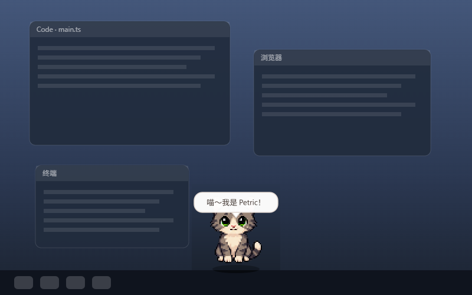
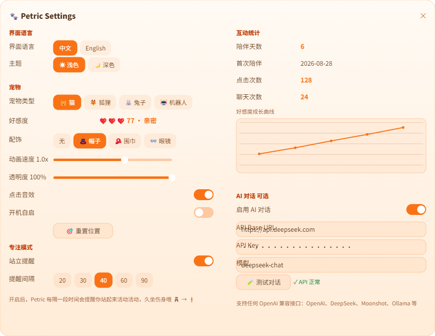

# 🐾 Petric · 跨平台桌面宠物

> **中文** | [English](./README-EN.md)


> Electron + TypeScript + HTML5 Canvas 构建的透明置顶桌面宠物（MVP）。
> 支持 Windows / macOS / Linux，像素风精灵动画、拖拽行走、睡眠、点击互动与 OpenAI 兼容 AI 对话。





---

## ✨ 功能一览

| 功能 | 说明 |
| :--- | :--- |
| 🪟 透明置顶窗口 | 300×300、无边框、始终置顶、不占任务栏、可拖拽移动 |
| 🌐 中英文切换 | 设置面板一键切换界面语言（中文 / English），台词与气泡随语言变化 |
| 🐱 像素桌宠动画 | 内置灰猫 / 狐狸 / 兔子 / 布噜 / 机器人；四态逐帧动画包含真实四肢、尾巴与耳朵动作 |
| 🧊 3D 模型皮肤 | 自定义外观支持 GLB 3D 模型（WebGL 渲染 + 射线点击判定 + 程序化动画） |
| ✂️ 本地 AI 自动抠图 | 导入图片后识别人、宠物或主要元素，生成透明 PNG（不上传、可开关、强度可调） |
| 🐾 照片宠物 | 上传自家宠物照片 → AI 抠图 → 直接成为桌宠；支持整图动作（跳舞 / 伸懒腰 / 歪头等） |
| 👀 眼睛跟随 | 机器人支持程序眼睛跟随；照片宠物标记两只眼睛后同样生效，打瞌睡会闭眼 |
| 🎞️ 四态动画 | `idle` 待机（呼吸+眨眼+尾巴摆动）· `walking` 行走（四肢交替迈步）· `sleeping` 入睡 · `click` 点击跳跃 |
| 💬 点击台词 | 单击播放跳跃动画 + 随机气泡台词（可自定义） |
| 🤖 AI 对话 | 双击打开 ChatGPT 风格的对话窗口：左侧会话列表 +「新的对话」/ 归档 / 重命名 / 删除；支持 OpenAI / DeepSeek 等任意兼容接口，历史保存在本机 |
| ⚙️ 设置面板 | 皮肤 / 动画速度 / 透明度 / 开机自启 / 音效 / AI 配置 / 重置位置 |
| 🎵 点击音效 | Web Audio 实时合成的短促“喵”音（可关闭） |
| ❤️ 好感度 | 点击 / 拖拽 / 聊天都会增进好感，5 个等级（陌生→挚友），角落爱心徽章实时展示 |
| ⏰ 专注模式 | 默认开启：每隔 40 分钟（可调 20~90 分钟）提醒“站起来活动活动啊老板！”，带提示音与跳跃动画，文案随语言切换 |
| ☀️🌙 主题切换 | 浅色（橙白渐变） / 深色（原紫调）一键切换，宠物气泡 / 对话窗口 / 设置面板同步换肤 |
| 🎩 装扮系统 | 机器人可戴程序化像素配饰：帽子 / 围巾 / 眼镜 |
| 🕺 随机小动作 | 发呆时自动打哈欠、伸懒腰、挠头、跳舞，让宠物"活"起来 |
| 🚶 自主走动 | 宠物会在桌面上自己走动 / 奔跑 / 跳跃，不再只是拖拽才动；开启后保持清醒不入睡（可开关） |
| 📊 互动统计 | 陪伴天数、点击 / 聊天次数、好感度成长曲线（设置面板图表展示） |
| 💬 主动搭话 | 空闲 10 分钟宠物会主动问好（可开关） |
| ☁️ 天气播报 | 点击宠物随机播报今日天气（免费 API，主进程请求，可开关） |
| ⏰ 整点报时 | 每小时整点宠物跳一下并报时（可开关） |
| 📍 记忆位置 | 记住上次位置，重启后回到原处 |
| 🔄 自动更新 | 打包安装版启动后自动检查 GitHub Releases 的新版本：后台下载 → 弹窗「一键重启更新」（类似 Discord；托盘 / 右键菜单可手动检查） |

**操作速查**

| 操作 | 效果 |
| :--- | :--- |
| 左键拖拽 | 宠物跟随移动，播放行走动画（好感度 +1） |
| 单击 | 跳跃动画 + 随机台词 + 音效（好感度 +1，升级时播报新等级） |
| 双击 | 打开 ChatGPT 风格的 AI 对话窗口（未启用 AI 时打开设置；每次聊天回复好感度 +2） |
| 右键 / 托盘 | 设置 / AI 对话 / 重置位置 / 退出 |
| `Ctrl + Shift + P` | 打开设置面板 |
| `Esc` | 宠物窗口按 Esc 退出应用；对话窗口内按 Esc 关闭该窗口 |
| 鼠标/键盘无操作 30s | 自动入睡（Zzz 飘动），任何操作唤醒 |

---

## 🚀 快速开始

### 环境要求

- Node.js ≥ 18（开发环境建议 20+）
- npm（随 Node 附带）

### 安装与运行

```bash
# 1. 安装依赖（首次会下载 Electron 二进制，约 100MB）
npm install

# 2. 开发运行（自动生成精灵图 + 编译 TS + 启动）
npm run dev
```

启动后，一只像素小猫会出现在屏幕中央。试试拖拽、单击、双击，以及 `Ctrl + Shift + P` 打开设置。

> 💡 **Windows 提示（PowerShell 执行策略）**
> 如果提示 `无法加载 npm.ps1，因为在此系统上禁止运行脚本`，任选其一：
>
> ```powershell
> # 方式 A：直接用 .cmd 版本（无需改任何设置）
> npm.cmd run dev
>
> # 方式 B：允许当前用户执行脚本（推荐，一次搞定）
> Set-ExecutionPolicy -Scope CurrentUser RemoteSigned
> npm run dev
> ```
>
> 本项目已内置 `scripts/run-electron.mjs` 启动包装器：它会清除可能被宿主环境
> 注入的 `ELECTRON_RUN_AS_NODE` 变量（避免 Electron 退化为纯 Node 模式），
> 并以继承 stdio 方式运行，确保日志与退出码正常透传。

### 常用脚本

| 命令 | 说明 |
| :--- | :--- |
| `npm run dev` | 构建并启动开发版本 |
| `npm run build` | 生成精灵图 + TypeScript 编译 + 拷贝静态资源到 `dist/` |
| `npm run sprites` | 仅重新生成像素精灵图与图标（`scripts/generate-sprites.mjs`） |
| `npm run smoke` | 构建并运行冒烟测试（自动检查宠物窗口 / 设置面板 / 对话窗口，含深度自检，退出码 0=通过） |
| `npm run dist` | 打包当前平台安装包（Windows: NSIS / macOS: DMG / Linux: AppImage+deb） |
| `npm run dist:win` / `dist:mac` / `dist:linux` | 打包指定平台 |

---

## 📦 打包与分发

使用 [electron-builder](https://www.electron.build/)，配置见 `electron-builder.yml`：

- **Windows**：`.exe`（NSIS 安装包，支持自定义安装目录、桌面快捷方式）
- **macOS**：`.dmg` + `.zip`（未签名，首次打开需右键→打开，或自行配置证书）
- **Linux**：`.AppImage` + `.deb`

```bash
npm run dist          # 打包当前平台
npm run dist:win      # 在 Windows 上打包 Windows 版
```

产物输出到 `release/` 目录。

> ⚠️ 平台说明：
> - 跨平台打包（如在 Windows 上打 macOS 包）需要对应平台环境，一般建议在 CI（GitHub Actions）里用各平台 runner 分别构建。
> - macOS 发布正式版需要 Apple Developer 证书签名与公证；个人使用可不签名。
> - Windows 首次运行 SmartScreen 可能提示“未知发布者”，点击“更多信息 → 仍要运行”即可（正式分发请配置代码签名证书）。

### 🔄 自动更新（类似 Discord）

打包安装版启动约 8 秒后会通过 **GitHub Releases** 自动检查新版本（`electron-updater`）：
发现新版即在后台下载 → 就绪后弹窗「🔄 立即重启更新」，一键退出、安装并重启到新版本；
托盘 / 宠物右键菜单也有「🔄 检查更新」（开发模式会提示不可用）。

- **Windows（NSIS）/ Linux（AppImage）**：支持全自动下载安装；macOS 未签名版无法自动
  安装，会引导打开下载页手动更新。
- 每次发版时，把安装包连同 electron-builder 生成的**元数据文件**一起挂到对应 tag 的
  GitHub Release：
  - Windows：`Petric Setup x.y.z.exe` + `latest.yml` + `.blockmap`
  - Linux：`Petric-x.y.z.AppImage` + `latest-linux.yml`
  - tag 建议与版本号一致（如 `v0.3.0`）。
- 本地构建不会自动上传：`npm run dist:win` 后把 `release/` 产物手动挂到 Release 即可。
- 自动更新只在**已安装的打包版**里生效；`npm run dev` 开发模式不触发。

---

## ⚙️ 设置面板

| 设置项 | 说明 |
| :--- | :--- |
| 界面语言 | 中文 / English 一键切换（持久化，托盘/右键菜单/气泡台词同步切换） |
| 主题 | 浅色（橙白渐变）/ 深色（紫调）一键切换，宠物窗口 / 对话窗口与设置面板同步生效 |
| 宠物类型 | 灰猫 🐱 / 狐狸 🦊 / 兔子 🐰 / 布噜 🐈 / 机器人 🤖，实时切换 |
| 配饰 | 无 / 帽子 🎩 / 围巾 🧣 / 眼镜 👓，程序化像素绘制，仅机器人显示 |
| 自动抠图 | 本地 U-2-Netp 主体分割，支持复杂照片背景；强度滑杆 8~60，仅对「单张图片」和「2.5D 立牌」生效 |
| 眼睛跟随 | 「单张图片」模式下标记照片里的两只眼睛，瞳孔跟随鼠标 + 眨眼 |
| 好感度 | 当前好感值与等级（点击 / 拖拽 / 聊天会增加，持久化保存） |
| 互动统计 | 陪伴天数、首次陪伴日期、点击 / 聊天次数、好感度成长曲线 |
| 动画速度 | 0.5x ~ 2x 滑块，作用于所有动画帧率 |
| 透明度 | 0.5 ~ 1.0 滑块（窗口整体透明度） |
| 点击音效 | Web Audio 合成音，可关闭 |
| 开机自启 | 基于 `app.setLoginItemSettings` 原生 API |
| 自主走动 | 宠物自己在桌面上走动 / 奔跑 / 跳跃；开启后不自动入睡，关闭恢复 30 秒入睡 |
| 重置位置 | 回到主屏幕中央 |
| 专注模式 | 站立提醒开关 + 提醒间隔（20 / 30 / 40 / 60 / 90 分钟） |
| 生活助手 | 主动搭话 / 天气播报 / 整点报时 三个独立开关 |
| AI 对话 | 启用开关 + Base URL + API Key + 模型名 + 测试按钮 |

### 🤖 配置 AI 对话

> ⚠️ **自带 Key（BYOK · Bring Your Own Key）**：本仓库**不内置任何 API Key**，默认配置
> 里只有占位值（Base URL 示例为 `https://api.openai.com/v1`），AI 对话默认关闭。
> 无论是你自己，还是 clone / 下载本仓库的其他人，都需要**自行注册 AI 服务商**并填写
> **自己的** Base URL + API Key + 模型名。程序只会把请求发给你填写的那个地址，绝不上传到他处。

双击宠物（或托盘 / 右键菜单「💬 AI 对话」）即可打开对话窗口；先到设置 →「AI 对话」完成配置。
任意 **OpenAI 兼容** 的 `/chat/completions` 接口均可使用：

| 服务商 | API Base URL | 模型示例 |
| :--- | :--- | :--- |
| OpenAI | `https://api.openai.com/v1` | `gpt-4o-mini` |
| DeepSeek | `https://api.deepseek.com`（自动补 `/v1`） | `deepseek-chat` |
| Moonshot | `https://api.moonshot.cn/v1` | `moonshot-v1-8k` |
| Ollama（本地） | `http://localhost:11434/v1` | `qwen2.5` |

填好后点「🧪 测试对话」验证，然后双击宠物开始聊天。

对话窗口支持多会话管理：左侧列表可 **新建对话 / 归档（📁 已归档区）/ 重命名 / 删除**；
同一份对话历史在宠物与对话窗口间实时共享。

> 🔒 **隐私与数据位置**：API Key 与对话历史只保存在本机
> - AI 配置：`userData/config.json`
> - 对话历史：`userData/chat-store.json`（主进程统一持久化，对话窗口与宠物共享）
> 不会上传到除你配置的 AI 服务商以外的任何地方；AI 功能默认关闭、不填 Key 不产生任何费用。

---

## 🎨 自定义指南

### 0. 🖼️ 用你自己的图片或 3D 模型当宠物（功能不变）

> 内置的猫/狐狸/兔子之外，你还可以用自己的图片或 3D 模型当宠物——拖拽、点击、睡眠、
> AI 对话、设置等所有功能照常工作（3D 模式下点击判定用射线检测）。

**方式一：应用内选择（推荐，打包后同样可用）**
设置面板 → 宠物类型选「🖼️ 自定义」→ 「选择文件…」→ 选图片或 `.glb` 模型，实时生效。
文件保存在 `userData/petric-custom/`，可随时「清除自定义外观」还原。

**方式二：命令行（开发环境便捷）**
```bash
# 单张图片（默认）
node scripts/set-custom.mjs 你的图片.png

# 精灵表（4 行 × 4 列帧动画）
node scripts/set-custom.mjs 你的精灵表.png --mode sheet

# 3D 模型（.glb，自动识别，无需 --mode）
node scripts/set-custom.mjs 你的模型.glb

# 还原默认
node scripts/set-custom.mjs --clear
```

**三种外观类型**

| 类型 | 说明 |
| :--- | :--- |
| 单张图片（single） | 任意 PNG / JPG / WebP / GIF（≤15MB）。整体显示，程序自动做呼吸 / 行走弹跳 / 睡眠变暗 / 点击跳跃动画。GIF 会按自身动画播放。 |
| 精灵表（sheet） | 4 行 × 4 列、每帧等大的精灵图（行序：idle / walking / sleeping / click），帧大小自动识别，完整保留四态帧动画。 |
| 3D 模型（model） | GLB 格式（≤60MB）。WebGL 渲染、自动适配大小与光照，程序化待机 / 行走 / 睡眠 / 点击动画，射线点击判定。可用 VRoid Studio 导出或用 Blender 导出 glTF Binary。 |
| 2.5D 立牌（billboard） | 单张图片放进 3D 场景：朝向光标转动、拖拽时倾斜、带透视投影，看起来立体、本质是平片；点击判定用射线 + 纹理 alpha 精修。 |

> ⚠️ 注意：机器人皮肤的眼睛由渲染进程叠加绘制（跟随鼠标、随机眨眼）；自定义照片
> 需要先在设置里「标记眼睛」才能实现眼睛跟随。其余交互全部保留。透明背景的图片效果最佳。
> 3D 模式需要显卡支持 WebGL（绝大多数电脑都支持）。

### 1. 替换 / 新增精灵图

灰猫 / 狐狸 / 兔子 / 布噜位于 `src/assets/animated-pets/`，均为 256×256 的 4×4 动画精灵表（每帧 64×64）；机器人位于 `src/assets/sprites/`，由 `scripts/generate-sprites.mjs` 程序化生成。

**方式 A：换用你自己的精灵表（推荐）**
直接把图片替换为同名文件即可，无需改代码：

```
src/assets/animated-pets/cat.png     ← 256×256，4 行×4 列（行序：idle/walking/sleeping/click，帧 64×64）
```

**方式 B：改生成器新增宠物**
在 `scripts/generate-sprites.mjs` 中：
1. 在 `PALETTES` 里加一套配色；
2. 在 `drawPet()` 里加一个 `kind` 分支（耳朵/尾巴/口鼻造型）；
3. 渲染进程注册皮肤：`src/renderer/app.ts` 的 `loadSheets()` 与 `src/renderer/settings.html` 的 `#skin-seg` 按钮（并在 `src/shared/i18n.ts` 加 `settings.skinXxx` 中英文案）；
4. `npm run sprites` 重新生成。

动物精灵表自带完整面部；机器人的眼睛、眨眼与所有皮肤的 Zzz 由渲染进程叠加绘制。

### 2. 修改台词

打开 `src/shared/i18n.ts`，编辑 `zhDict` / `enDict` 里的 `lines` 数组（点击台词随界面语言切换）：

```ts
lines: ['喵～', '别摸我！', '饿了…', '今天也要加油鸭！'],   // zhDict
lines: ['Meow~', "Don't touch me!", 'I\'m hungry…'],       // enDict
```

### 3. 调整动画 / 睡眠等参数

- 各状态帧率：`src/renderer/app.ts` 的 `SHEET.states`（与生成器 `STATE_FPS` 对应）
- 睡眠阈值：`SLEEP_MS`（默认 30000ms）
- 眨眼节奏：`blinkTimer` 的随机范围
- 泡泡样式 / 台词框：`src/renderer/styles.css` 的 `#bubble`

---

## 🗂️ 项目结构

```
petric/
├── src/
│   ├── main/
│   │   ├── main.ts            # 主进程：窗口/托盘/IPC/AI 请求/聊天编排/开机自启
│   │   ├── chat-store.ts      # 对话仓库：会话数据本地持久化（userData/chat-store.json）
│   │   └── preload.ts         # contextBridge 暴露 window.api
│   ├── renderer/
│   │   ├── index.html         # 宠物窗口页面
│   │   ├── styles.css         # 宠物窗口样式（透明背景 / 气泡 / 好感度徽章）
│   │   ├── i18n.ts            # 渲染层 i18n（window.PetricI18n，字典来自主进程）
│   │   ├── app.ts             # Canvas 绘制、动画状态机、拖拽、交互与聊天好感奖励
│   │   ├── pet3d.ts           # 3D 模型渲染（three.js UMD + GLTFLoader，射线点击判定）
│   │   ├── chat.html / chat.css / chat.ts   # ChatGPT 风格对话窗口（会话列表/消息/归档）
│   │   ├── settings.html      # 设置面板页面
│   │   ├── settings.css       # 毛玻璃设置面板样式
│   │   └── settings.ts        # 设置面板逻辑
│   ├── shared/
│   │   ├── types.ts           # 全局共享类型（三方通用，无运行时）
│   │   ├── config.ts          # 配置读写（userData/config.json）
│   │   └── i18n.ts            # 中英文 UI 字符串字典（单一来源）
│   └── assets/
│       ├── sprite-sources/    # 猫 / 狐狸 / 兔子原始立绘参考
│       ├── animated-pets/     # 灰猫 / 狐狸 / 兔子 / 布噜的 64px 四态动画精灵表
│       ├── sprites/           # 程序化生成的机器人及兼容精灵表
│       ├── models/            # 测试 3D 模型 test-pet.glb
│       ├── vendor/            # 本地化的 three.js UMD 构建（MIT）
│       ├── icon.png / icon.ico / icon.icns / tray.png
├── scripts/
│   ├── generate-sprites.mjs   # 像素精灵与图标生成器（零依赖 PNG 编码）
│   ├── prepare-animated-pet.mjs # 清理、切分并标准化 4×4 动画素材
│   ├── copy-vendor.mjs        # 从 node_modules 拷贝 three.js UMD 到 vendor/
│   ├── make-test-model.mjs    # 生成测试 3D 模型（GLB）
│   ├── copy-assets.mjs        # 构建时拷贝 html/css/assets 到 dist/
│   ├── run-electron.mjs       # Electron 启动包装器（清除 ELECTRON_RUN_AS_NODE）
│   └── set-custom.mjs         # 命令行设置自定义外观（图片 / 精灵表 / 3D 模型）
├── package.json
├── tsconfig.json
├── electron-builder.yml
├── README.md
└── README-EN.md
```

**技术要点**

- 主进程 / 预加载 / 渲染进程全部 TypeScript，`tsc` 编译为 CommonJS（渲染层为无模块单脚本，避免 file:// 下 ES Module 的 CORS 限制）。
- 渲染进程与主进程仅通过 `window.api`（IPC）通信，`contextIsolation: true` + `sandbox: true`。
- AI 网络请求放在**主进程**发起，规避浏览器 CORS 限制。
- 对话数据在**主进程统一管理**（`chat-store.ts` 持久化到 `userData/chat-store.json`），宠物窗口与对话窗口通过 `chats-changed` 广播实时同步同一份历史。
- 拖拽采用屏幕坐标绝对定位（`screenX/Y` + 窗口位置），无累积漂移。
- 透明窗口 + `backgroundThrottling: false`，保证 `requestAnimationFrame` 常驻运行。
- 3D 模式用本地化（vendored）的 **three.js UMD（MIT）** 构建，无需打包器；点击判定用 `THREE.Raycaster` 射线检测替代 2D 像素命中。

---

## 🧪 已知限制（MVP）

- **点击穿透（逐像素命中）**：只有光标落在宠物的**可见像素**上才会触发交互；透明区域点击直接穿透到桌面（Windows 基于 `setIgnoreMouseEvents(forward)` 动态切换；3D 模式用射线检测）。macOS / Linux 不支持 `forward`（开启穿透后收不到事件、宠物会不可达），退化为渲染层命中判定——透明区域不会触发宠物交互，但仍会拦截点击（不会穿透到桌面）。
- **3D 模式（当前阶段）**：仅支持 GLB；VRM 人形模型（骨骼表情等）属于下一阶段。3D 需要 WebGL 支持；2D/3D 反复切换时可能需重启窗口才能重新初始化 WebGL 上下文。
- **macOS 透明窗口**：已隐藏 Dock 图标；如需毛玻璃（vibrancy）效果可自行在 `main.ts` 中添加。
- **未签名打包**：Windows SmartScreen / macOS Gatekeeper 会提示未知开发者。
- **内置外观数量**：灰猫 / 狐狸 / 兔子 / 布噜 / 机器人，更多皮肤可参考「自定义指南」。

---

## 📸 演示与截图

```bash
# 自动生成 README 顶部配图（docs/screenshots/）
npm run build && electron . --screenshot
```

- `docs/screenshots/pet-cat.png`：宠物在（模拟）桌面上的效果（真实精灵图合成）
- `docs/screenshots/settings-panel.png`：设置面板（画布复刻版）
- `docs/screenshots/demo.gif`：拖拽 / 点击 / 动画切换 / AI 对话演示——在自己电脑上
  运行应用后用 [ScreenToGif](https://www.screentogif.com/) 录制后放入

> 想用真实桌面截图替换自动生成的配图？直接在 `docs/screenshots/` 覆盖同名文件即可。

---

## 🤝 贡献指南

欢迎任何形式的贡献：

- 🎨 新增精灵图皮肤（遵循 32×32 帧 / 4 行精灵表规范，或扩展生成器）
- ✨ 新动画状态 / 交互（番茄钟、天气感知、多显示器多宠物等）
- 🐛 Bug 修复与体验优化
- 📖 文档与演示

流程：Fork → 新建分支 → 提交 PR。请确保 `npm run build` 通过，并附上修改说明。

---

## 📄 许可证

[MIT](./LICENSE) © Petric Contributors

- 灰猫 / 狐狸 / 兔子 / 布噜动画素材基于项目提供的参考图生成并随仓库分发；机器人由本项目程序化生成。
- 3D 渲染使用 [three.js](https://threejs.org/)（MIT，已本地化到 `src/assets/vendor/`）。
- 若替换第三方精灵图或 3D 模型，请自行确认其许可证（推荐 CC0 / MIT / OGA-BY 3.0 并在 README 注明来源）。
